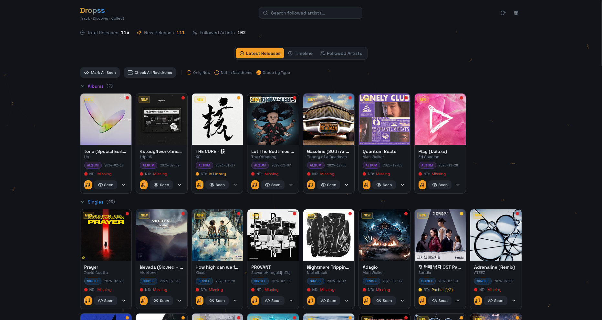
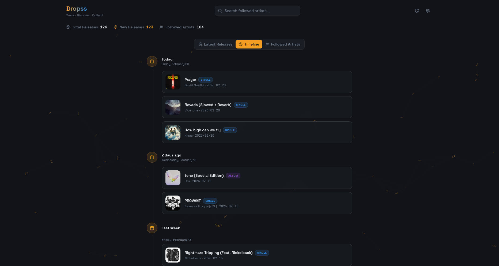
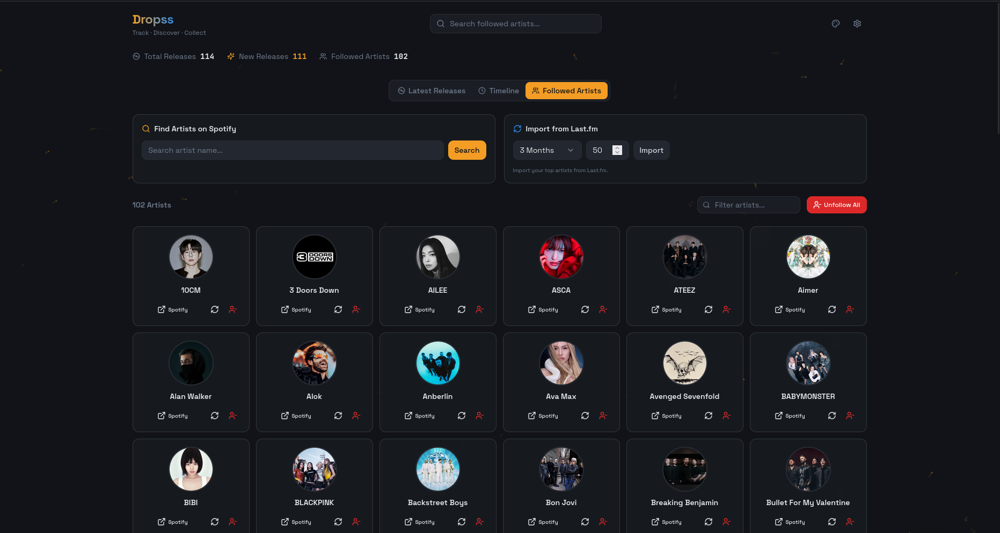
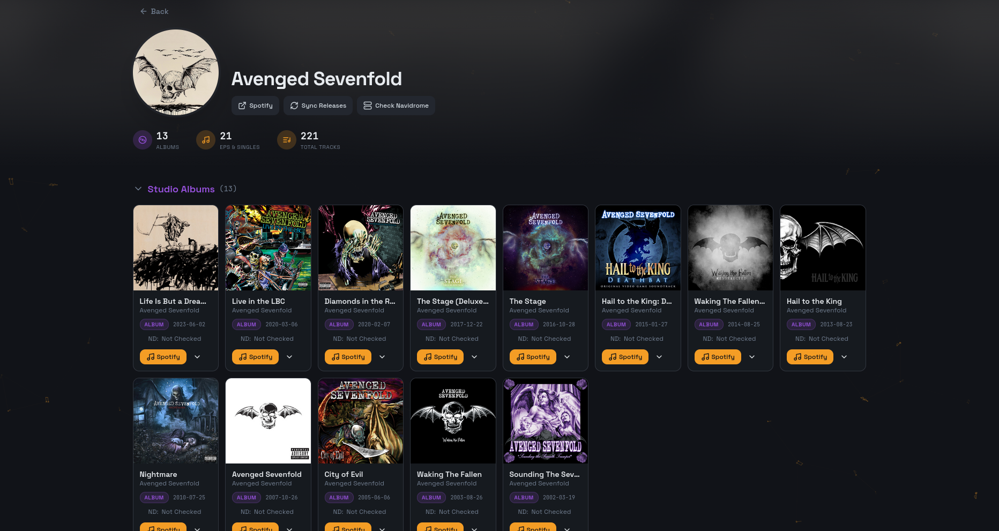
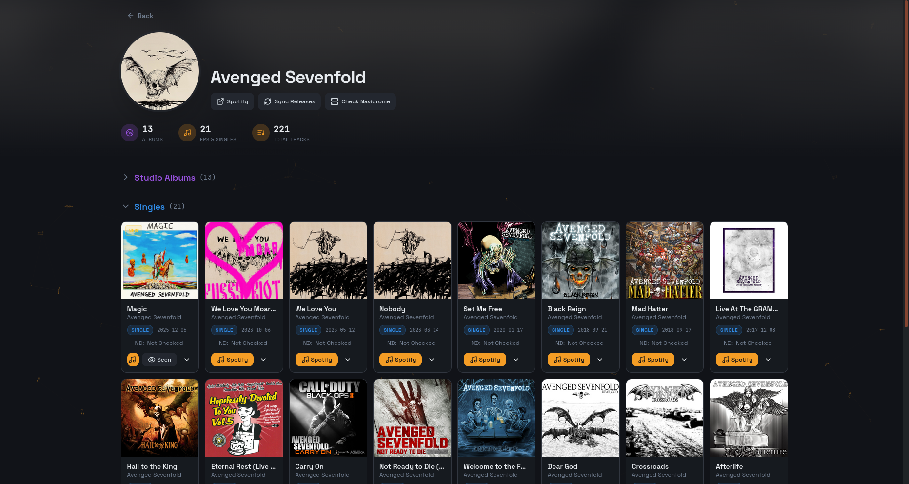
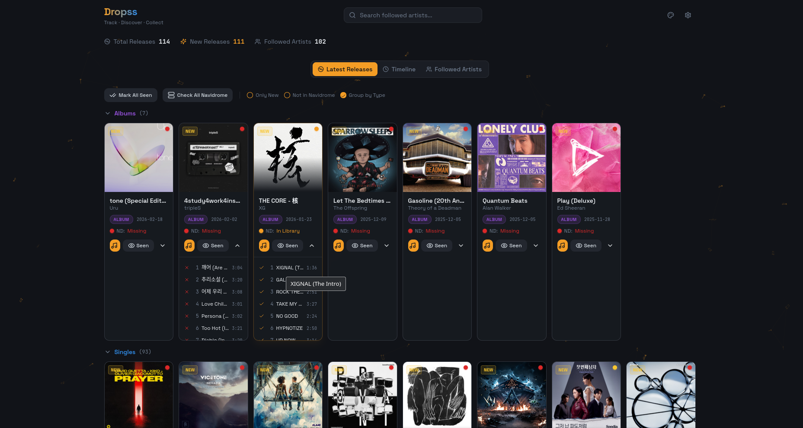

# Dropss

Dropss is a self-hosted app to track followed artists, detect new releases, and optionally notify you through your preferred channels.

## Screenshots

| | |
|---|---|
|  |  |
|  |  |
|  |  |

## Features

- Track artists from Spotify
- See latest releases in a clean dashboard
- Daily scheduled release checks
- Optional notifications via Gotify and ntfy
- Optional library checks against Jellyfin, Plex, and Navidrome
- Optional Last.fm import for top artists
- Single-user session auth with optional API keys for external apps
- Docker-first deployment with persistent data volumes

## Prerequisites

- Docker + Docker Compose for containerized setup
- Python 3.12, Node.js 20+, and PostgreSQL for non-Docker setup

## Configuration

1. Copy the template:

```bash
cp .env.docker.example .env
```

2. Set required values in `.env`:

- `POSTGRES_PASSWORD` 
- `SPOTIFY_CLIENT_SECRET`
- `GOTIFY_TOKEN`
- `JELLYFIN_API_KEY`
- `PLEX_TOKEN`
- `NAVIDROME_PASSWORD`
- `AUTH_ENABLED=true` with `APP_PASSWORD` and `APP_SECRET_KEY` for protected access

Spotify client secret is mandatory. Other tokens and API Keys can only be set in .env file and will be mandatory if you plan on using those services. Others can be set direcly in settings of the application or in the .env as well. 

3. If you access the UI through Tailscale or another hostname/IP, include that frontend origin in `CORS_ORIGINS`.

4. Any `.env` change requires container recreate to apply:

```bash
docker compose up -d --force-recreate
```

## Run With Docker

```bash
cp .env.docker.example .env
# edit .env
docker compose up -d
```

Open `http://localhost:3000`.

Notes:
- Backend runs internally on `8619` behind frontend nginx.
- Runtime settings are persisted in Docker volume `dropss_settings`.

## Run With Docker (Development)

```bash
cp .env.docker.example .env
docker compose -f docker-compose.dev.yml up --build
```

Default dev endpoints:
- Frontend: `http://localhost:8093`
- Backend: `http://localhost:8620`
- Dev DB: `localhost:5433`


## Run Without Docker

1. Prepare `.env` in project root:

- Set `DATABASE_URL` to your local PostgreSQL, for example:
  `postgresql+psycopg://dropss:<password>@localhost:5432/dropss`
- Set `SPOTIFY_CLIENT_ID` and `SPOTIFY_CLIENT_SECRET`
- Set `CORS_ORIGINS=http://localhost:8080`
- Set auth values (`AUTH_ENABLED`, `APP_PASSWORD`, `APP_SECRET_KEY`) as desired

2. Start backend:

```bash
cd backend
python3 -m venv venv
source venv/bin/activate
pip install -r requirements.txt
./start-backend.sh
```

3. Start frontend in a second terminal:

```bash
cd frontend
npm ci
npm run dev
```

Open `http://localhost:8080`.

## Integrations

- Spotify API
- Last.fm
- Gotify
- ntfy
- Jellyfin
- Plex
- Navidrome

## License

This project is licensed under the GNU General Public License v3.0.
See [`LICENSE`](LICENSE).
